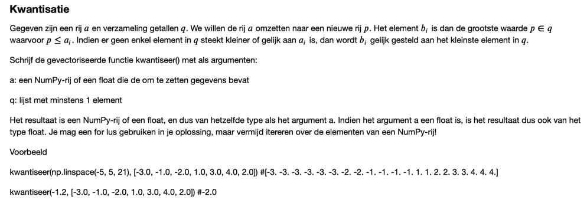

# Python package thomas

# Thomas' Excercises

## June 2023

## June 2024

[oefening 1](oef1.pdf)

    A B
    C D 

[oefening 2](oef2.pdf)
[oefening 3](oef3.pdf)

### examen oefening

Gegeven een tabel a met 0’en en 1’en.
Maak een nieuwe tabel b van zelfde grootte.
Indien a[i,j] == 1 en som van de buren van a[i,j] is 2 of 3, dan b[i,j] = 1, anders 0.
Indien a[i,j] == 0 en som van de buren van a[i,j] is 1, dan a[i,j] = 1, anders 0.
Ik vermoed dat de laatste regel 
Indien a[i,j] == 0 en som van de buren van a[i,j] is 1, dan a[i,j] = 1, anders 0.

